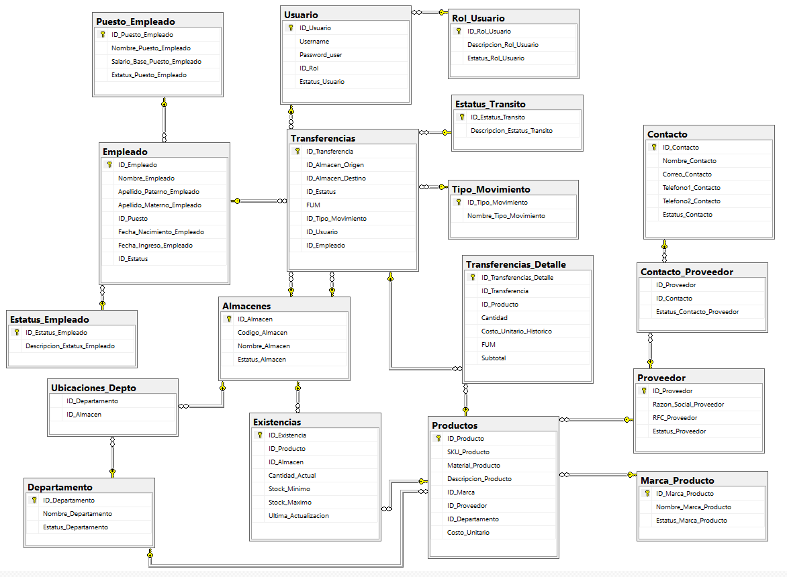
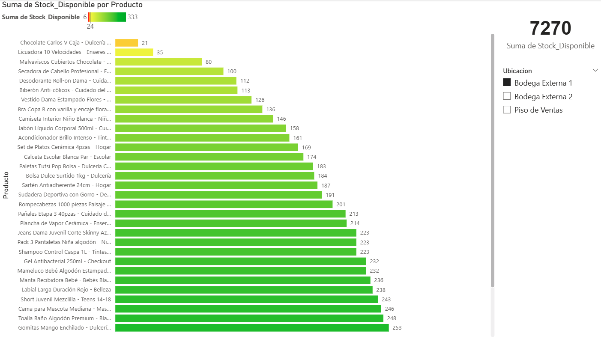

# 🏬 Proyecto Bodeguita: Gestión Inteligente de Inventarios Retail

## 🎯 Descripción del Proyecto
Este proyecto nace de la necesidad real en el sector retail de centralizar la información de inventarios y optimizar el proceso de surtido. "Bodeguita" es una solución integral que abarca desde el diseño robusto de la base de datos hasta la visualización estratégica de KPIs clave, permitiendo pasar de una operación basada en "hojas de papel" a decisiones basadas en datos.

## 🛠️ Tecnologías Utilizadas
* **Base de Datos:** T-SQL (SQL Server) para el diseño, creación y manipulación de datos.
* **Business Intelligence:** Power BI para la creación del tablero de control interactivo.

##📑 Guía de Archivos SQL
* **Para replicar este proyecto, los scripts deben ejecutarse en el siguiente orden:

1. 01_Creacion_Tablas_Base.sql: Define la arquitectura y relaciones (PK/FK).
2. 02_Llenado_de_informacion.sql: Inserta datos maestros y movimientos iniciales.
3. 04_Crear_Vista.sql / 05_Crear_Vista_Inventario.sql: Estas son las capas de inteligencia. En lugar de conectar Power BI a tablas crudas, se conecta a estas Vistas, lo que optimiza el rendimiento y asegura que el cálculo del stock sea exacto y en tiempo real.

## 🧠 Arquitectura de Datos (DER)
El corazón del proyecto es una base de datos relacional diseñada para garantizar la integridad de la información y soportar el flujo operativo de una tienda departamental (entradas, salidas, traspasos entre almacenes).

Se implementaron restricciones de unicidad (`CONSTRAINT UQ_Producto_Almacen`) para asegurar que cada producto tenga un único registro de existencia por almacén, evitando duplicidad de datos críticos.

## 📊 Solución de Visualización (Power BI Dashboard)
El tablero interactivo resuelve tres preguntas críticas para la operación diaria:
1.  **Estado Global:** ¿Cuánta mercancía total tenemos? (Tarjeta de KPI).
2.  **Stock Crítico:** ¿Qué productos están por debajo del nivel de seguridad (menor o igual a 6 piezas)? (Gráfico de barras con formato condicional tipo semáforo).
3.  **Visibilidad por Ubicación:** ¿Dónde está la mercancía? (Segmentador por Almacén/Piso de Venta).

## 💡 Próximos Pasos (Validación de Pedidos)
Para el futuro, se planea implementar una lógica de base de datos que cruce las diferentes fuentes de pedidos (Listas Cero, Manuales, Automáticos) para detectar y bloquear surtidos duplicados, resolviendo un cuello de botella operativo actual.
